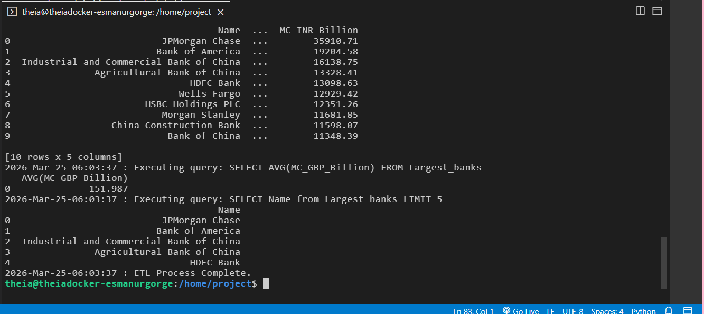

# 🏦 Automated Banking Data ETL Pipeline

This project demonstrates a complete **ETL (Extract, Transform, Load)** pipeline built with Python. It automates the process of gathering financial data from the web, transforming it based on real-time exchange rates, and storing it for professional analysis.

## 🎯 Project Overview
The goal is to provide an automated system for a fictional international firm to track the world's largest banks by market capitalization. The script extracts data from Wikipedia, performs currency conversions, and saves the results in both flat-file (CSV) and relational database (SQL) formats.

## 🛠️ Key Features & Tasks
- **Extraction:** Web scraping using `BeautifulSoup` to capture bank names and market caps from HTML tables.
- **Transformation:** - Currency conversion from **USD** to **GBP, EUR, and INR**.
  - Data cleaning (removing newline characters, formatting types).
  - Precision handling (rounding to 2 decimal places).
- **Loading:**
  - Saves a clean dataset as `Largest_banks_data.csv`.
  - Loads data into a SQLite database (`Banks.db`) for SQL querying.
- **Logging:** Implemented a custom `log_progress` function to track every stage of the pipeline with timestamps for auditability.

## 💻 Tech Stack
- **Language:** Python 3.x
- **Libraries:** Pandas, NumPy, BeautifulSoup4, Requests, Sqlite3
- **Concepts:** Web Scraping, Data Engineering, SQL, Error Handling

## 📊 Sample SQL Queries Executed
The script automatically verifies the data by running:
1. `SELECT * FROM Largest_banks` (Full view)
2. `SELECT AVG(MC_GBP_Billion) FROM Largest_banks` (Average calculation)
3. `SELECT Name from Largest_banks LIMIT 5` (Top performers)

---
## 📊 Pipeline Output
The screenshot below shows the final extraction and SQL query results, demonstrating the successful transformation of USD values into multiple currencies (GBP, EUR, INR):

---
*This project is part of my Data Engineering & Science foundations journey.*